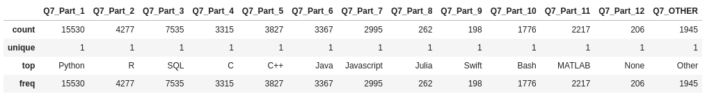

[인퍼런 URL](https://www.inflearn.com/course/%EC%BA%90%EA%B8%80-%EC%84%A4%EB%AC%B8%EC%A1%B0%EC%82%AC/)

## panda
- value_counts
  Series에만 사용가능
~~~
각 Answer를 말한 Count수
answer["Q1"].value_counts()

각 Answer를 말한 Count 비율
answer["Q1"].value_counts(normalize=true)

각 Answer를 말한 Count 퍼센테이지
answer["Q1"].value_counts(normalize=true)*100

인덱스 가져오기
answer["Q1"].value_counts().index
~~~

- sort_index
~~~
인덱스 순으로 sort
answer["Q1"].value_counts().sort_index()
~~~

- sort_values
~~~
sort_values("count", ascending=False)
~~~

- plot
~~~
인덱스 순으로 sort한 후 plot 그림으로 보기
answer["Q1"].value_counts().sort_index().plot()
answer["Q1"].value_counts().sort_index().plot.bar()   <== 막대 그래프 가로
answer["Q1"].value_counts().sort_index().plot.barh()  <== 막대 그래프 세로
answer["Q1"].value_counts().sort_index().plot.bar(rot=0)  <== x축의 value모양을 가로모양으로 바꿔줌.


~~~

- crosstab
~~~
2개의 값을 함께 보여고 싶을때
q1q2 = pd.crosstab(answer["Q1"], answer["Q2"])
q1q2[["Man", "Woman"]].plot.bar(rot=0)

==> []하나면 series 형태로/ [[]]리스트면 dataFrame형태로 리턴한다.

행/열을 변경하고 싶으면
q1q2 = pd.crosstab(answer["Q1"], answer["Q2"]).T

~~~

- groupby
~~~
멀티답변인 경우 crosstab을 쓰는 방법
q2q7 = answer.filter(regex="Q7|Q2$")
q2q7.groupby("Q2").count()
~~~

- filter
~~~
정규표현식으로 필터링
answer_Q7 = answer.filter(regex="Q7")
question.filter(regex="Q7")[0].split("-")[0]
~~~

- describe
기술통계값 구하기


~~~
answer_Q7_desc = answer_Q7.describe() 
answer_Q7_desc.loc[["top","count"]] ==> 리스트 형식
answer_Q7_desc.loc[["top","count"]].T.set_index("top")
~~~


## 기타
- loc
  - 인덱스(세로) 기준 데이터를 가져오는 방법(인덱스가 string이여도 가능)
  ``` raw.iloc[0]```
- iloc
  - 인덱스(세로) 기준 넘버행으로 가져오는 방법
  ```raw.loc[0]```

- 사용설명서 보기
  - 끝에 ?표 붙이기
  ```raw.drop?```

- 소스코드 보기
  - 끝에 ??표 붙이기
  ```raw.drop??```

- 데이터 정보 보기
  - 데이터의 종류/크기/타입등을 알고 싶을때 
```answer.info()```

- 리스트 형태로 넘겨주기
  ```answer[qno].value_counts().sort_index().index.tolist()```

- isnull()/notnull()
  - null값만 true/null값이 아닌 경우만 true
  ```answer_Q7.notnull().sum()```

- columns
  - 테이블의 컬럼값을 변경한다.
  ```q2q7.columns=q7_cols ```

- replace
  - string을 변환
  ~~~
  q24_count["min"]=q24_count["range"].str.split("-",expand=True)[0]
  q24_count["min"].str.replace(",|^$,>","").astype(int)  
  ~~~

- isin
  - 특정 string만 뽑을때
  ~~~
  answer[answer["Q3"].isin([United State of America])]
  ~~~
   
## seaborn
seaborn 을 이용하여 다양한 그래프로 표현


- 막대 그래프 (countplot)
~~~
import seaborn as sns
sns.countplot(data=answer, x="Q1")

인덱스로 sort를 한 그래프를 보고 싶다면
sns.countplot(data=answer.sort_values("Q1"), x="Q1")
==> 데이터 answer의 값을 Q1 을 기준으로 소팅을 한후, Q1의 데이터를 그래프로 그려라

타이틀을 붙여줘라
sns.countplot(data=answer.sort_values("Q1"), x="Q1").set_title(question["Q1"])

그라디에이션을 이용해라 
sns.countplot(data=answer.sort_values("Q1"), x="Q1", 
              palette="Blues_r").set_title(question["Q1"])
==> Blues_r 에서 r을 reverse란 의미로, 짙은 색부터 옅은색으로 칠하게 된다.   

사이즈 변경
plt.figure(figsize=(10, 10))
sns.countplot(data=answer.sort_values("Q1"), x="Q1", hue="Q2").set_title("Age & Gender")

순서를 변경
order = answer[qno].value_counts().index ==> 인덱스를 가져오거나 만들수 있다.
sns.countplot(data=answer, 
                y=qno,
                order=order,         #<== 오더를 지정해준다.(오더는 리스트형태)
                palette="Blues_r"
                ).set_title(question[qno]) 


sns.barplot(data=answer_Q7_count,y=answer_Q7_count.index, x="count", palette="Blues_r")

Q2에 따라 색을 다르게 표현하고 싶다.
sns.countplot(data=answer, x="Q1", hue="Q2")

~~~
